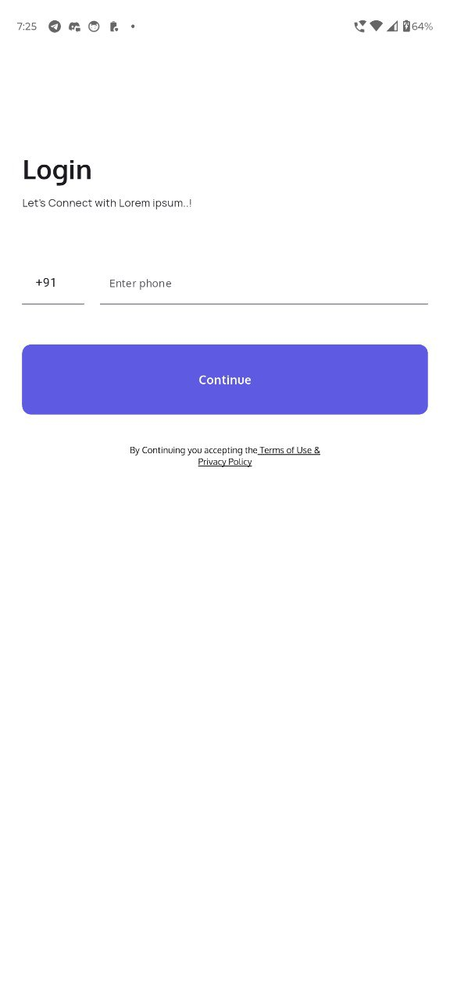
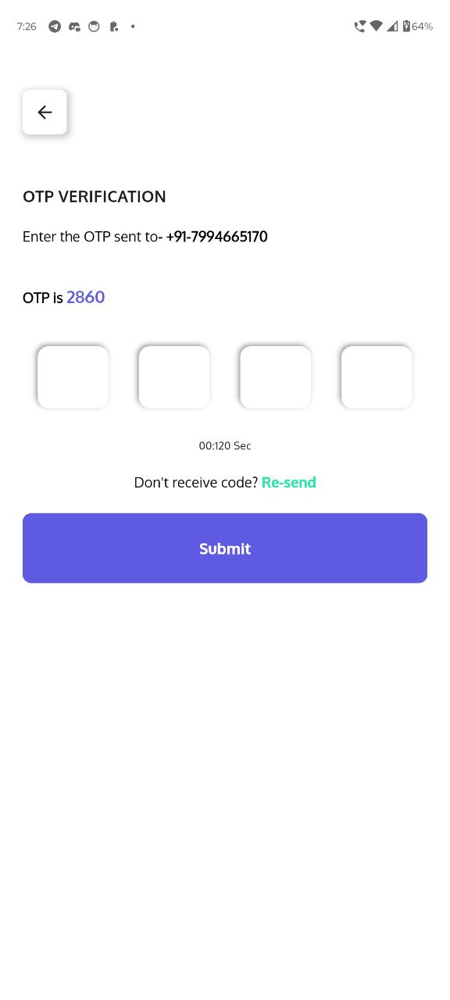

# Skill Test

[](https://flutter.dev/)
[](LICENSE)

A Flutter project to demonstrate app functionality and skill testing with API integration, state management, and UI features.

---

## Screenshots


  
  
  

---

## Features

- Authentication (Login & Register with OTP)
- Product listing and detailed view
- API integration using HTTP and secure storage for JWT
- State management using BLoC
- Responsive UI with Flutter widgets
- Error handling and loading states

---

## Getting Started

### Prerequisites

- Flutter installed ([Installation Guide](https://docs.flutter.dev/get-started/install))
- IDE: VS Code, Android Studio, or IntelliJ
- Emulator or connected device

### Installation & Running

1. **Clone the repository**

```bash
git clone https://github.com/Steevebgeorge/zybo_test.git
cd zybo_test
run flutter clean
run flutter pub get
run project

